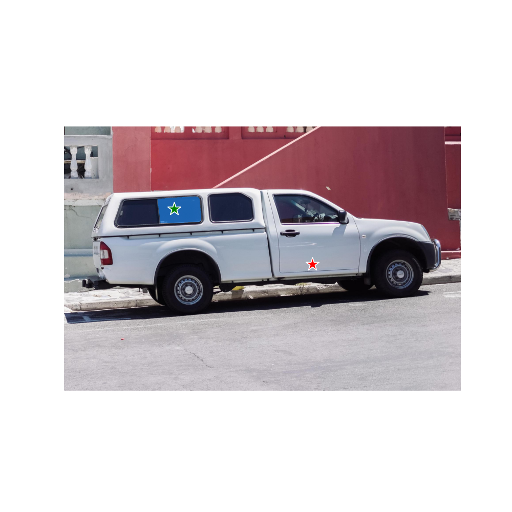
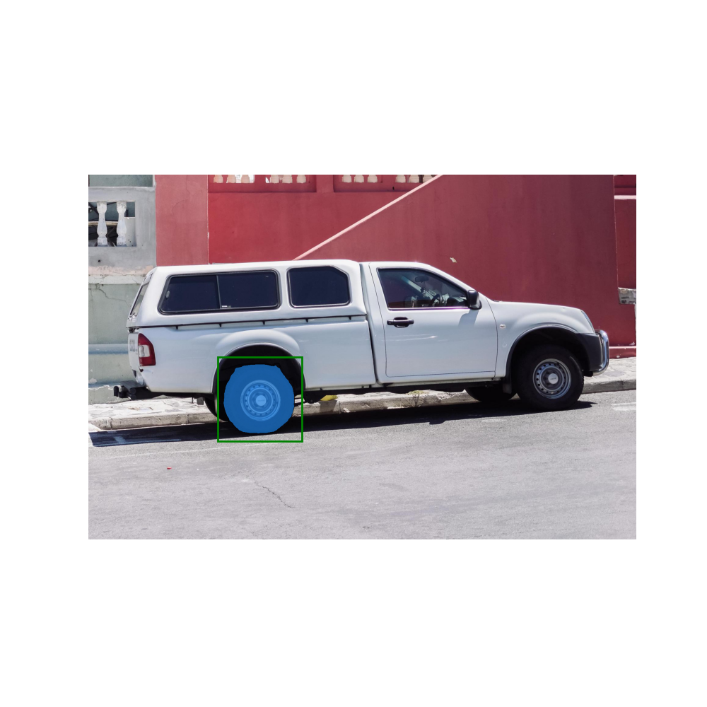
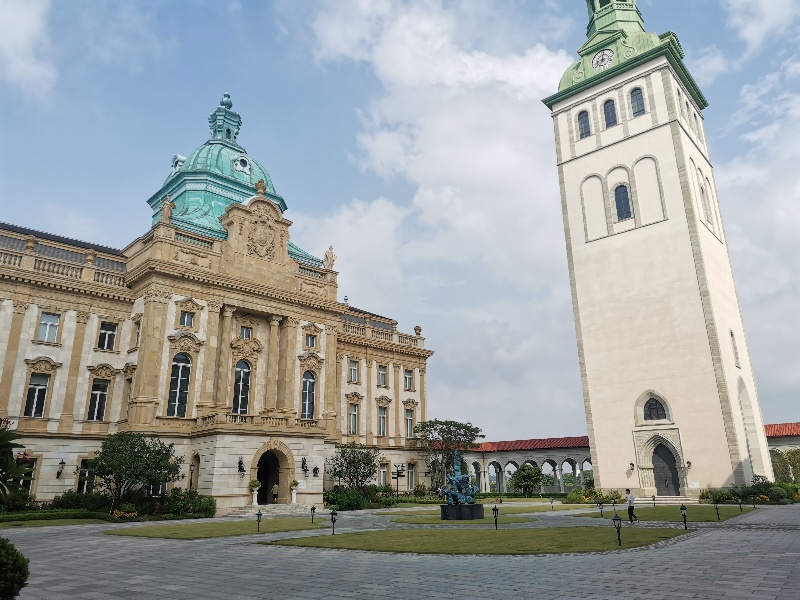
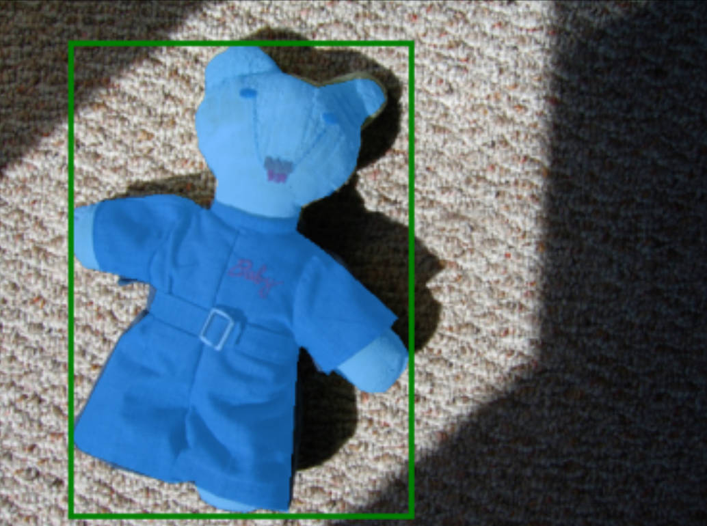
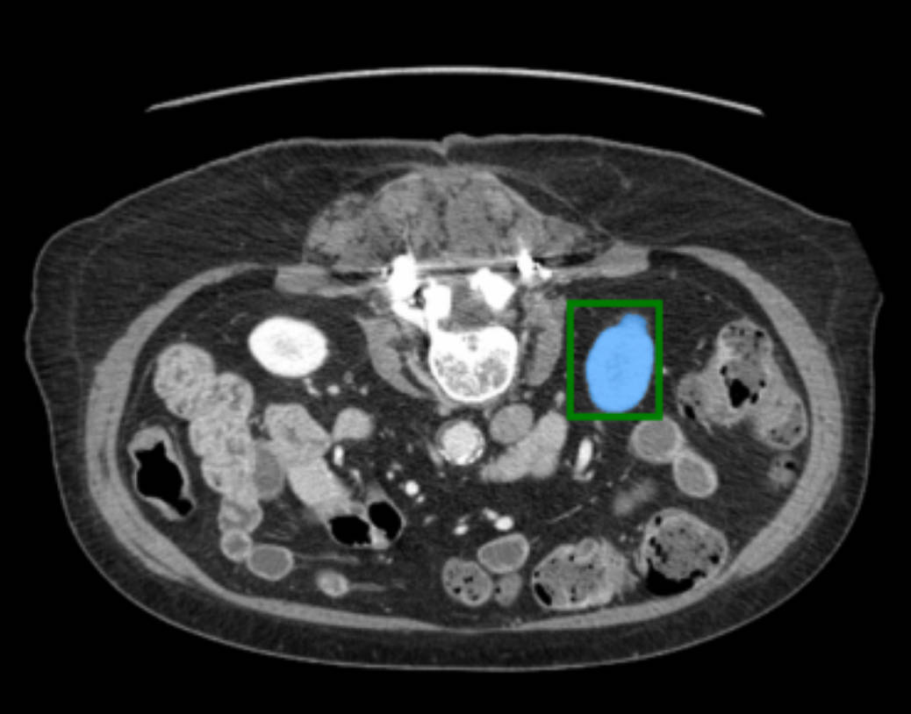

# Segment Anything

The **Segment Anything Model (SAM)** produces high quality object masks from input prompts such as points or boxes, and it can be used to generate masks for all objects in an image. It has been trained on a [dataset](https://segment-anything.com/dataset/index.html) of 11 million images and 1.1 billion masks, and has strong zero-shot performance on a variety of segmentation tasks.

## Installation

The code requires `python>=3.7` and `mindspore>=2.0` and supports both GPU and Ascend platform. Please follow the instructions [here](https://www.mindspore.cn/install) to install mindspore dependencies.

Clone the repository locally and install with

```shell
git clone https://github.com/mindspore-lab/models.git
cd research/segment-anything
pip install -r requirements.txt
```

## Inference

First download the weights ([sam_vit_b](https://download.mindspore.cn/toolkits/mindone/sam/sam_vit_b-35e4849c.ckpt), [sam_vit_l](https://download.mindspore.cn/toolkits/mindone/sam/sam_vit_l-1b460f38.ckpt), [sam_vit_h](https://download.mindspore.cn/toolkits/mindone/sam/sam_vit_h-c72f8ba1.ckpt)) and put them under `${project_root}/models` directory.
There are two recommended ways to use sam.

### Using sam with prompts

SAM predicts object masks given prompts that indicate the desired object. if a point prompt is given, three plausible masks are generated.

```shell
python demo/inference_with_promts.py --prompt-type point --model-type vit_h
```

<p float="left">
    
</p>

If a prompt with two points is given, one plausible mask is generated instead of 3 because of less ambiguity compared to one point prompt.
The star in green and red denotes positive and negtive point, respectively.

<div align="center">
    
</div>

If a box prompt is given, one plausible masks is generated.

```shell
python demo/inference_with_promts.py --prompt-type box --model-type vit_h
```

<div align="center">
    
</div>

If a prompt with both a box and a point is given, one plausible mask is generated.

```shell
python demo/inference_with_promts.py --prompt-type point_box --model-type vit_h
```

<div align="center">
    
</div>

See `python demo/inference_with_promts.py --help` to explore more custom settings.

### Using sam with Automatic Mask Generation(AMG)

Since SAM can efficiently process prompts, masks for the entire image can be generated by sampling a large number of prompts over an image. AMG works by sampling single-point input prompts in a grid over the image, from each of which SAM can predict multiple masks. Then, masks are filtered for quality and deduplicated using non-maximal suppression. Additional options allow for further improvement of mask quality and quantity, such as running prediction on multiple crops of the image or postprocessing masks to remove small disconnected regions and holes.

```shell
python demo/inference_with_amg.py --model-type vit_h
```

<div align="center">

      

</div>

See `python demo/inference_with_amg.py --help` to explore more custom settings.

## Finetune

Finetune is a popular method that adapts large pretrained model to specific downstream tasks. Currently, finetune with box-prompt are supported. The bounding boxes are used as prompt input to predict mask.
Beside fine-tuning our code on COCO2017 dataset which contains common seen objects and lies in the similar distribution of the original [training dataset](https://segment-anything.com/dataset/index.html) of SAM, We have done further experiments on a medical imaging segmentation dataset [FLARE22](https://flare22.grand-challenge.org/Dataset/). Result shows that the finetune method in this repository is effective.

The bellowing shows the mask quality before and after finetune.


| pretrained_model | dataset  |    epochs     | mIOU |
|:----------------:| -------- |:-------------:|------|
|    sam-vit-b     | COCO2017 | 0 (zero-shot) | 77.4 |
|    sam-vit-b     | COCO2017 |      20       | 83.5 |
|    sam-vit-b     | FLARE22  | 0 (zero-shot) | 79.5 |
|    sam-vit-b     | FLARE22  |      10       | 88.1 |

To finetune COCO dataset, please run:

```shell
mpirun --allow-run-as-root -n 8 python train.py -c configs/coco_box_finetune.yaml
```

The original FLARE22 dataset contains image in 3D format and ground truth labelled as instance segmentation ids. Run

```shell
python scripts/preprocess_CT_MR_dataset.py
```

to preprocess it to the format of 2D RGB image and binary mask

To finetune FLARE22 dataset, please run:

```shell
mpirun --allow-run-as-root -n 8 python train.py -c configs/flare_box_finetune.yaml
```

Here are the examples of segmentation result predicted by fine-tuned SAM:

<div align="center">

    

</div>

<p align="center">
  <em> COCO2017 image example</em>
                        
                        
  <em> FLARE22 image example </em>
</p>


