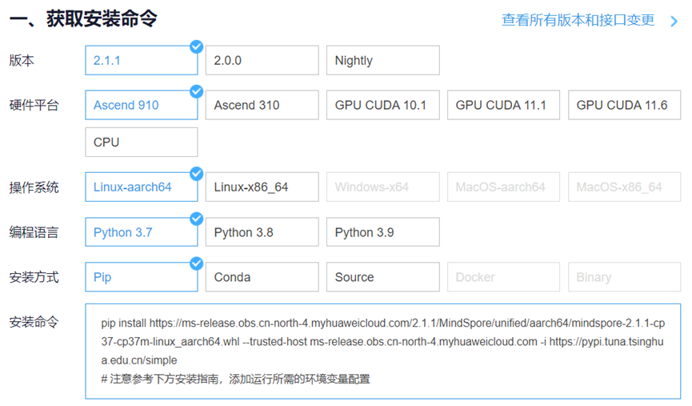

# M-Libcity

## 一、介绍

M-libcity 是一个基于华为MindSpore框架实现的开源算法库，专注于城市时空预测领域。它为MindSpore开发人员提供了统一、全面、可扩展的时空预测模型实现方案，同时为城市时空预测研究人员提供了可靠的实验工具和便捷的开发框架。M-LibCity开源算法库涵盖了与城市时空预测相关的所有必要步骤和组件，构建了完整的研究流程，使研究人员能够进行全面的对比实验。这将为研究人员在MindSpore平台上开展城市时空预测研究提供便利和强大的支持。

## 二、安装与配置

### *Mindspore安装*



#### 1.	获取安装命令，在Mindspore官网（https://www.mindspore.cn/install）寻找官方命令：

- 如果是在全新的系统上使用pip安装Mindspore，可以使用自动安装脚本进行一键式安装。安装脚本会安装Mindspore以及其所需要的依赖。
- 如果系统已经安装了部分依赖，如Python，GCC等，可以参照手动安装步骤进行。

#### 2.	自动安装，自动安装脚本如下：

```
1. # wget https://gitee.com/mindspore/mindspore/raw/r2.0/scripts/install/euleros-ascend-pip.sh  
2. # 安装MindSpore 2.0.0和Python 3.7  
3. # 默认LOCAL_ASCEND路径为/usr/local/Ascend  
4. MINDSPORE_VERSION=2.0.0 bash -i ./euleros-ascend-pip.sh  
5. # 如需指定Python和MindSpore版本，以Python 3.9和MindSpore 1.6.0为例  
6. # 且指定LOCAL_ASCEND路径为/home/xxx/Ascend，使用以下方式  
7. # LOCAL_ASCEND=/home/xxx/Ascend PYTHON_VERSION=3.9 MINDSPORE_VERSION=1.6.0 bash -i ./euleros-ascend-pip.sh  
```

其执行内容如下：

- 1) 更改软件源配置为华为云源。
- 2) 安装MindSpore所需的依赖，如GCC。
- 3) 通过APT安装Python3和pip3，并设为默认。
- 4) 通过pip安装MindSpore CPU版本。
- 5) 自动安装脚本执行完成后，需要重新打开终端窗口以使环境变量生效。

#### 3.	手动安装

安装MindSpore所需要的系统环境和第三方依赖如下表：

安装Python（通过APT安装）

```
1.  sudo apt-get update  
2.  sudo apt-get install software-properties-common -y  
3.  sudo add-apt-repository ppa:deadsnakes/ppa -y  
4.  sudo apt-get install python3.7 python3.7-dev python3.7-distutils python3-pip -y  
5.  # 将新安装的Python设为默认  
6.  sudo update-alternatives --install /usr/bin/python python /usr/bin/python3.7 100  
7.  # 安装pip  
8.  python -m pip install pip -i https://repo.huaweicloud.com/repository/pypi/simple  
9.  sudo update-alternatives --install /usr/bin/pip pip ~/.local/bin/pip3.7 100  
10. pip config set global.index-url https://repo.huaweicloud.com/repository/pypi/simple  
```

安装完成后可以查看Python版本：

``1.	python --version``

安装GCC:

``1.	sudo apt-get install gcc -y ``

安装MindSpore,本项目测试时使用的是2.0.0版本的MindSpore，以此为例。

``1.	export MS_VERSION=2.0.0``

然后根据系统架构及Python版本执行如下命令安装MindSpore

```
1.  # x86_64 + Python3.7  
2.  pip install https://ms-release.obs.cn-north-4.myhuaweicloud.com/${MS_VERSION}/MindSpore/cpu/x86_64/mindspore-${MS_VERSION/-/}-cp37-cp37m-linux_x86_64.whl --trusted-host ms-release.obs.cn-north-4.myhuaweicloud.com -i https://pypi.tuna.tsinghua.edu.cn/simple  
3.  # x86_64 + Python3.8  
4.  pip install https://ms-release.obs.cn-north-4.myhuaweicloud.com/${MS_VERSION}/MindSpore/cpu/x86_64/mindspore-${MS_VERSION/-/}-cp38-cp38-linux_x86_64.whl --trusted-host ms-release.obs.cn-north-4.myhuaweicloud.com -i https://pypi.tuna.tsinghua.edu.cn/simple  
5.  # x86_64 + Python3.9  
6.  pip install https://ms-release.obs.cn-north-4.myhuaweicloud.com/${MS_VERSION}/MindSpore/cpu/x86_64/mindspore-${MS_VERSION/-/}-cp39-cp39-linux_x86_64.whl --trusted-host ms-release.obs.cn-north-4.myhuaweicloud.com -i https://pypi.tuna.tsinghua.edu.cn/simple  
7.  # aarch64 + Python3.7  
8.  pip install https://ms-release.obs.cn-north-4.myhuaweicloud.com/${MS_VERSION}/MindSpore/cpu/aarch64/mindspore-${MS_VERSION/-/}-cp37-cp37m-linux_aarch64.whl --trusted-host ms-release.obs.cn-north-4.myhuaweicloud.com -i https://pypi.tuna.tsinghua.edu.cn/simple  
9.  # aarch64 + Python3.8  
10. pip install https://ms-release.obs.cn-north-4.myhuaweicloud.com/${MS_VERSION}/MindSpore/cpu/aarch64/mindspore-${MS_VERSION/-/}-cp38-cp38-linux_aarch64.whl --trusted-host ms-release.obs.cn-north-4.myhuaweicloud.com -i https://pypi.tuna.tsinghua.edu.cn/simple  
11. # aarch64 + Python3.9  
12. pip install https://ms-release.obs.cn-north-4.myhuaweicloud.com/${MS_VERSION}/MindSpore/cpu/aarch64/mindspore-${MS_VERSION/-/}-cp39-cp39-linux_aarch64.whl --trusted-host ms-release.obs.cn-nort
```

检验是否安装成功:

进入Python执行以下命令：

```
1.  import mindspore;  
2.  mindspore.run_check()
```

如果输出如下信息则表示安装成功：

```
1.  MindSpore version: 版本号  
2.  The result of multiplication calculation is correct, MindSpore has been installed successfully!  
```

### *运行的Python环境依赖*

```
matplotlib==3.5.1
moxing_framework==2.1.7.dc1f3d0b//启智平台需要
networkx==2.5
numpy==1.21.6
pandas==1.3.5
scikit_learn==0.24.0
scipy==1.5.4
tqdm==4.62.3
mindspore应为2.0.0版本，且与后端对应
```

## 三、使用说明

### *快速运行代码命令*

```
1.  cd [rootpath for project]
2.  python test_pipeline.py
```

注意，需要去test_pipeline.py文件中更改模型和数据集

### *修改模型参数*

所有的pipeline默认参数都存放在M_libcity/config文件夹下。
模型配置文件可在M_libcity/config/model文件夹下找到，该文件夹按照model的类别进行分类。
task_config.json记录了模型要加载的具体数据模块配置文件、执行模块配置文件、评估模块配置文件和模型模块配置文件，可通过task_config.json查看对应关系。
如想添加其他参数，可以在test_pipeline.py中的run_model()中通过other_args={key:value}的形式传递。

*PS：所有参数的注释以及取值可从https://bigscity-libcity-docs.readthedocs.io/en/latest/user_guide/config_settings.html 搜索得到。*

### *数据集*

所有数据集都存放在M_libcity/raw_data下。
缺少的数据集可以从网站 https://pan.baidu.com/s/1qEfcXBO-QwZfiT0G3IYMpQ with psw 1231 or https://drive.google.com/drive/folders/1g5v2Gq1tkOq8XO0HDCZ9nOTtRpB6-gPe?usp=sharing 中获得。
如想自行处理数据集，可以参照 https://github.com/LibCity/Bigscity-LibCity-Datasets 中的处理脚本。

### *调试任务实现多卡训练*

调用 M_libcity/run.sh 文件

1.单卡训练，启动方式为：

```
1.  bash run.sh 1 [task] [model_name] [dataset] or python test_pipeline.py or test_pipeline_[model_name].py
```

参数 `1`表示单卡, PS: [task] 表示需要运行的任务，[model_name] 表示需要运行的模型，[dataset] 表示需要运行的数据集
2.多卡训练,启动方式为：

```
1.  bash run.sh 2 [task] [model_name] [dataset]
```

参数 `2`表示卡数为2。
