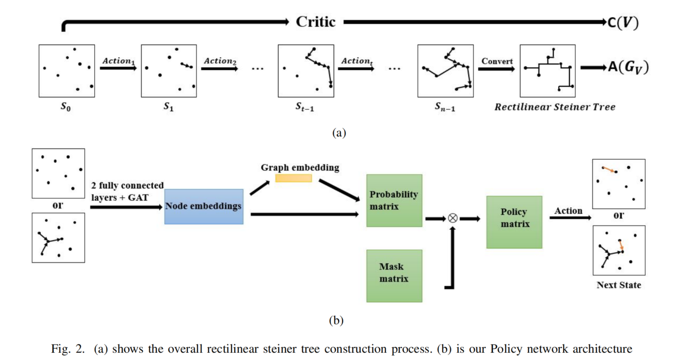

# Towards Timing-Driven Routing: An Efficient Learning Based Geometric Approach

This project is a simplified MindSpore version of the code for the 2023 ICCAD paper "Towards Timing-Driven Routing: An Efficient Learning Based Geometric Approach". It trades off between path length (shallowness) and wirelength (lightness). The code is still being refined.


# Model Structure:




More details see the paper.

# Code Structure:

- src: the model file and training file by mindspore.
- data: the training dataset and eval dataset.
- algorithm: some baseline approach of RSMT.

# Training:

 

```shell
python train.py
```

**Note**: Due to certain features in MindSpore, such as the `mindspore.nn.probability.distribution.Categorical` function used for sampling, which requires input probabilities to be strictly greater than 0, it is impossible to completely mask out edges that should not be selected, such as loops and self-loops.

