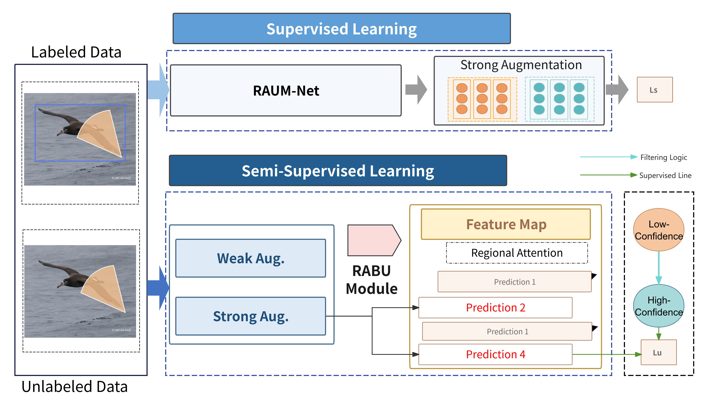

# RAUM-Net
# RAUM-Net: 半监督细粒度视觉分类网络

<div align="center">
  
</div>

## 项目简介

RAUM-Net (Regional Attention and Uncertainty Mamba Network) 是一个专为解决半监督细粒度视觉分类(FGVC)在遮挡和标签稀缺环境下的挑战而设计的创新框架。本项目实现了论文中提出的完整方法，包括高效的Mamba骨干网络和创新的区域注意力与贝叶斯不确定性(RABU)模块。

## 主要特点

- **Mamba架构**: 提供强大的细粒度特征提取能力
- **区域注意力机制**: 专注于未被遮挡的关键区域
- **贝叶斯不确定性量化**: 实现严格的伪标签过滤

## 主要结果

RAUM-Net在多个FGVC基准数据集上的实验表明，我们的方法显著优于现有的最先进方法，尤其在以下方面表现突出：

- 在各种半监督和遮挡条件下性能优异
- 在严重遮挡或极端标签稀缺情况下展现出显著的鲁棒性和更高的分类准确率
- 模型效率高，推理速度与使用相同VMamba-S骨干网络的基线方法相当

## 数据集支持

本项目支持多个标准FGVC数据集，包括但不限于：
- CUB-200-2011
- Stanford Cars
- FGVC-Aircraft

## 使用方法

### 环境配置

```bash
# 安装依赖
pip install mindspore==2.3.0
pip install mindcv
pip install -r requirements.txt
```

### 训练模型

```bash
# 半监督训练示例
python train_raum_net.py --dataset cub200 --labeled-ratio 0.1 --occlusion-rate 0.3
```

### 评估模型

```bash
python evaluate.py --ckpt path/to/checkpoint --dataset cub200
```


## 实验结果

### 表1. SOTA方法在CUB-200和Stanford Cars数据集上的性能比较（Top-1准确率%）

| 数据集 | 方法 | 标签比例 | 无遮挡 | 轻度遮挡(20%) | 重度遮挡(40%) |
|------|------|---------|------|------------|------------|
| CUB-200-2011 | FixMatch | 10% | 16.5 | 12.1 | 8.2 |
| CUB-200-2011 | FlexMatch | 10% | 17.2 | 12.8 | 8.9 |
| CUB-200-2011 | AnomalyMatch | 10% | 17.8 | 13.5 | 9.6 |
| CUB-200-2011 | RAUM-Net (Ours) | 10% | **19.8** | **16.5** | **14.1** |
| CUB-200-2011 | FixMatch | 50% | 56.8 | 50.1 | 43.5 |
| CUB-200-2011 | FlexMatch | 50% | 57.5 | 51.0 | 44.4 |
| CUB-200-2011 | AnomalyMatch | 50% | 58.2 | 51.9 | 45.3 |
| CUB-200-2011 | RAUM-Net (Ours) | 50% | **60.9** | **57.4** | **52.5** |
| Stanford Cars | FixMatch | 10% | 83.9 | 78.2 | 70.4 |
| Stanford Cars | FlexMatch | 10% | 84.7 | 79.1 | 71.3 |
| Stanford Cars | AnomalyMatch | 10% | 85.5 | 80.0 | 72.1 |
| Stanford Cars | RAUM-Net (Ours) | 10% | **87.2** | **84.3** | **79.5** |
| Stanford Cars | FixMatch | 50% | 91.1 | 84.8 | 78.2 |
| Stanford Cars | FlexMatch | 50% | 91.8 | 86.3 | 79.1 |
| Stanford Cars | AnomalyMatch | 50% | 92.4 | 87.0 | 80.0 |
| Stanford Cars | RAUM-Net (Ours) | 50% | **94.0** | **91.2** | **86.8** |

表格中展示了我们的RAUM-Net方法在不同标签比例（10%和50%）和不同遮挡条件（无遮挡、轻度遮挡20%和重度遮挡40%）下的性能，与现有的SOTA半监督学习方法进行了比较。结果表明，RAUM-Net在所有测试条件下都取得了最佳性能，尤其在遮挡情况下优势更为显著。

此外，RAUM-Net在模型效率方面也表现出色，相比基线VMamba-S模型仅增加约0.1M参数和0.4G FLOPs的计算开销，同时保持相当的推理速度，证明其作为一种高效且实用的解决方案，在资源受限的真实世界应用中具有巨大潜力。

## 引用


## 致谢

我们衷心感谢MindSpore社区提供了强大而高效的深度学习框架，有力地支持了我们的研究工作。同时，我们也对OpenI平台提供的宝贵计算资源和支持表示感谢，这些资源对于完成本论文中的大量实验至关重要。


