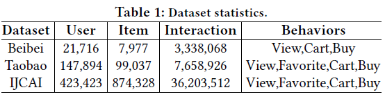
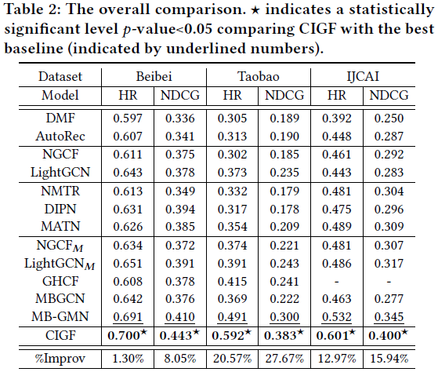

# Dataset

- Beibei, Taobao, and IJCAI
- https://github.com/MC-CV/CIGF

# Environment Requirements(#contents)

- Hardware（GPU）
    - Prepare hardware environment with GPU processor.
- Framework
    - MindSpore-2.2.0 (https://www.mindspore.cn/install/en)
- Requirements
  - pandas
  - numpy
  - random
  - mindspre
  - h5py
- For more information, please check the resources below：
  - MindSpore Tutorials (https://www.mindspore.cn/tutorials/en/master/index.html)
  - MindSpore Python API (https://www.mindspore.cn/docs/en/master/index.html)

# Performance

Experimental Result only for reference:

- Dataset

- Result

