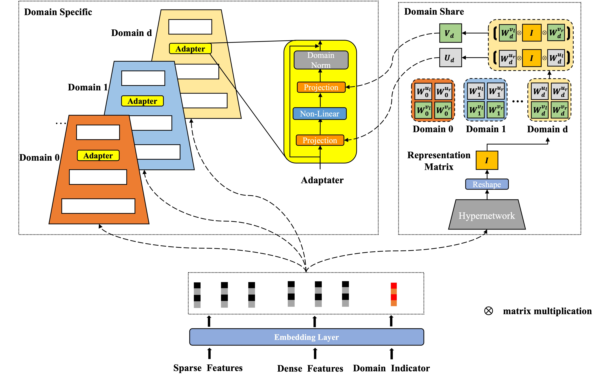
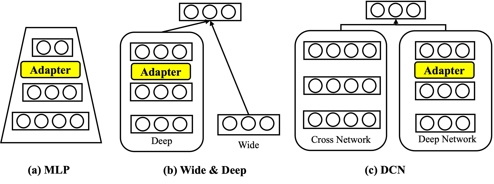

# HAMUR

Official mindspore implementation of our paper "HAMUR: Hyper Adapter for Multi-Domain Recommendation" in CIKM 2023.

Cite our paper if you find this repository interesting or helpful:
```
@inproceedings{li2023hamur,
  title={HAMUR: Hyper Adapter for Multi-Domain Recommendation},
  author={Li, Xiaopeng and Yan, Fan and Zhao, Xiangyu and Wang, Yichao and Chen, Bo and Guo, Huifeng and Tang, Ruiming},
  booktitle={Proceedings of the 32nd ACM International Conference on Information and Knowledge Management},
  pages={1268--1277},
  year={2023}
}
```

## Introduction
Source code of HAMUR: Hyper Adapter for Multi-Domain Recommendation, in Proceedings of the 32nd ACM International Conference on Information and Knowledge Management(CIKM 23').


## Environment Setting
* mindspore = 2.2.0
* numpy = 1.21.2
* pandas = 2.0.3
* scikit-learn = 1.3.2

## Dataset Download
In this paper, we use two datasets, **Aliccp** and **movieLens**. Dataset samples are shown in example/data.

Real Dataset download methods:
* Aliccp : Download address https://tianchi.aliyun.com/dataset/408.
* Movielens : The raw data precess file could be found in [Torch-Rechub-ml-1m](https://github.com/morningsky/Torch-RecHub/tree/main/examples/matching/data/ml-1m). You could direct download processed file from https://cowtransfer.com/s/5a3ab69ebd314e.

## Models
In this repo, we offer the following models, list as follows. Their structures are shown in the following picture.

* Pure MLP as multi-domain backbone models.
* MLP + HAMUR
* Pure Wide & Deep as multi-domain backbone models.
* Wide & Deep + HAMUR
* Pure DCN as multi-domain backbone models. 
* DCN + HAMUR

## Usage

### Step 1 : Clone the repository

### Step 2 : Run the model
```Shell
cd examples
# For Aliccp
python run_ali_ccp_ctr_ranking_multi_domain.py --model_name mlp_adp --epoch 5 --device cpu --seed 2022 
# For MovieLens
python run_movielens_rank_multi_domain.py --model_name mlp_adp --epoch 5 --device cpu --seed 2022 

```


