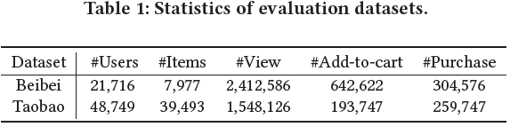
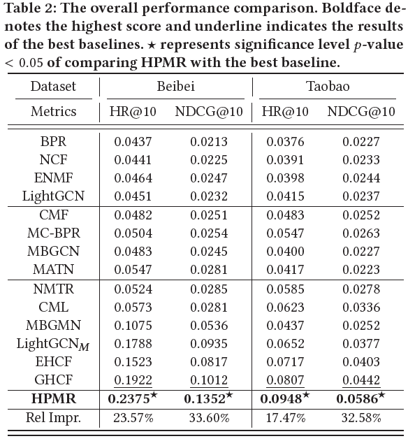

# Hierarchical Projection Enhanced Multi-behavior Recommendation

This repository contains Mindspore codes for the paper.

# Dataset

- Beibei, Taobao
- https://github.com/MC-CV/HPMR

# Environment Requirements(#contents)

- Hardware（GPU）
    - Prepare hardware environment with GPU processor.
- Framework
    - MindSpore-2.2.0 (https://www.mindspore.cn/install/en)
- Requirements
  - pandas
  - numpy
  - random
  - mindspre
  - h5py
- For more information, please check the resources below：
  - MindSpore Tutorials (https://www.mindspore.cn/tutorials/en/master/index.html)
  - MindSpore Python API (https://www.mindspore.cn/docs/en/master/index.html)


# Performance

Experimental Result only for reference:

- Dataset



- Result




## Citation

If you want to use our codes and datasets in your research, please cite:
```
@inproceedings{meng2023hierarchical,
  title={Hierarchical Projection Enhanced Multi-behavior Recommendation},
  author={Meng, Chang and Zhang, Hengyu and Guo, Wei and Guo, Huifeng and Liu, Haotian and Zhang, Yingxue and Zheng, Hongkun and Tang, Ruiming and Li, Xiu and Zhang, Rui},
  booktitle={Proceedings of the 29th ACM SIGKDD Conference on Knowledge Discovery and Data Mining},
  pages={4649--4660},
  year={2023}
}
```