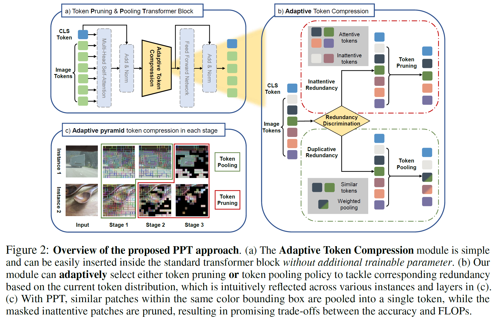
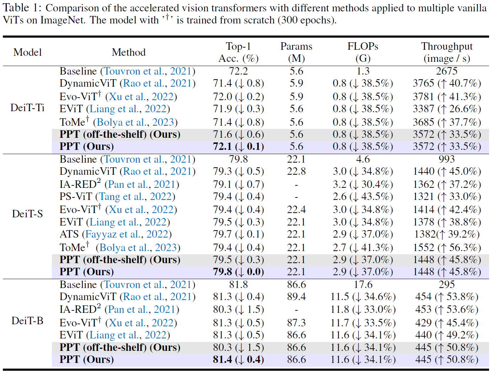
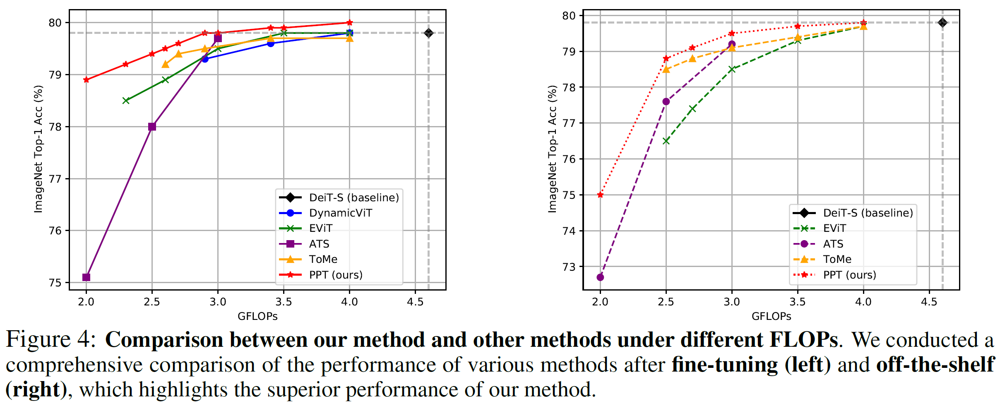
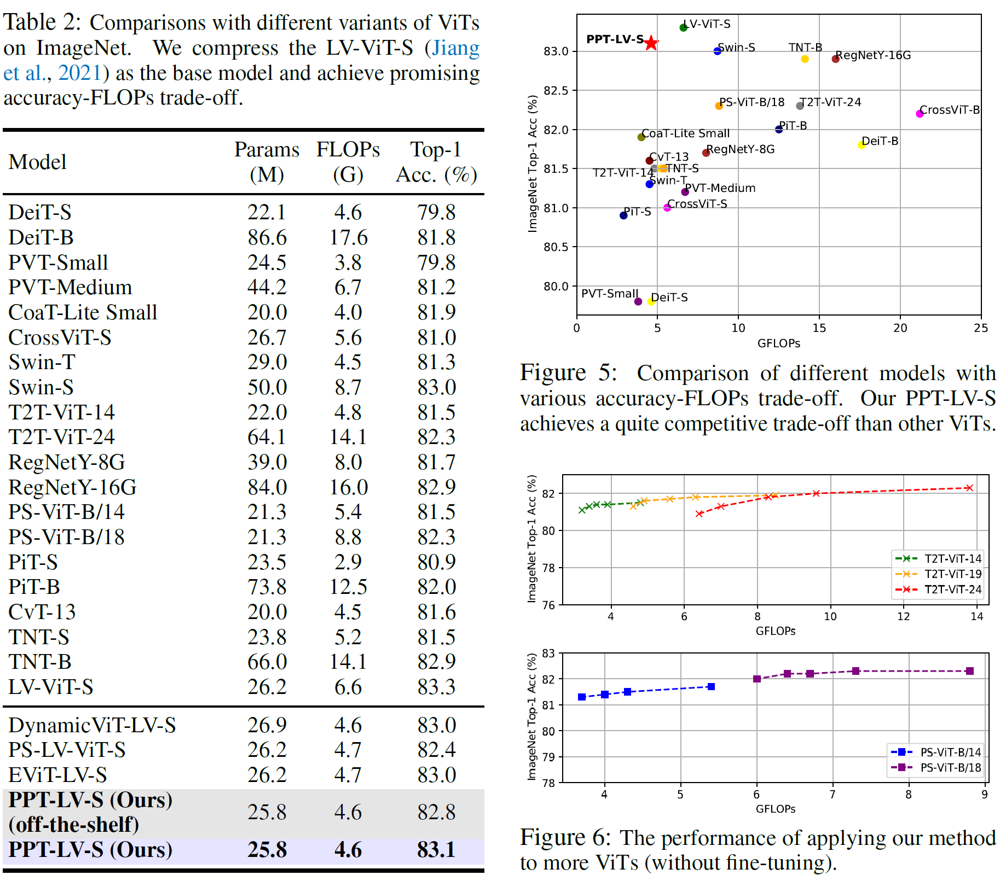

# Contents

- [Contents](#contents)
- [PPT Description](#ppt-description)
- [Model Architecture](#model-architecture)
- [Model Description](#model-description)
  - [Performance](#performance)
- [Dataset](#dataset)
- [Environment Requirements](#environment-requirements)
- [Quick Start](#quick-start)
  - [Prepare the model](#prepare-the-model)
  - [Run the scripts](#run-the-scripts)
- [Script Description](#script-description)
  - [Script and Sample Code](#script-and-sample-code)
    - [Directory structure](#directory-structure)
  - [Evaluation](#evaluation)
    - [Evaluation process](#evaluation-process)
      - [Evaluation with checkpoint](#evaluation-with-checkpoint)
    - [Evaluation results](#evaluation-results)

# [PPT Description](#contents)

PPT: Token Pruning and Pooling for Efficient Vision Transformers

This repository contains Mindspore evaluation code and pretrained models for the PPT-DeiT, arXiv 2023

They obtain competitive tradeoffs in terms of speed / precision

[Paper](https://arxiv.org/abs/2310.01812): Xinjian Wu, Fanhu Zeng, Xiudong Wang, Yunhe Wang, Xinghao Chen, PPT: Token Pruning and Pooling for Efficient Vision Transformers.

# [Model Architecture](#contents)



# [Model Description](#contents)

The proposed framework, named as token Pruning & Pooling Transformers (PPT), can jointly tackle the **inattentive redundancy** and **duplicative redundancy** in images. Experiment results demonstrate that our method outperforms state-of-the-art token compression methods, and achieves superior trade-off between accuracy and computational. Moreover, our method introduces ***no trainable parameters***. This indicates that it can be easily integrated into pre-trained ViTs with minimal accuracy degradation, and fine-tuning with PPT can lead to improved accuracy and faster training speed, making it especially beneficial for huge models.

## Performance







# [Dataset](#contents)

Note that you can run the scripts based on the dataset mentioned in original
paper or widely used in relevant domain/network architecture. In the following
sections, we will introduce how to run the scripts using the related dataset
below.

Dataset used: [ImageNet2012](http://www.image-net.org/)

* Dataset size：146.6G
    * Train：139.3G，1281167 images
    * Val：6.3G，50000 images
    * Annotations：each image is in label folder
* Data format：images sorted by label folders
    * Note：Data will be processed in imagenet.py

# [Environment Requirements](#contents)

* Install [MindSpore](https://www.mindspore.cn/install/en).
* Download the dataset ImageNet dataset.
* We use ImageNet2012 as training dataset in this example by default, and you
  can also use your own datasets.

For ImageNet-like dataset the directory structure is as follows:

```shell
 .
 └─imagenet
   ├─train
     ├─class1
       ├─image1.jpeg
       ├─image2.jpeg
       └─...
     ├─...
     └─class1000
   ├─val
     ├─class1
     ├─...
     └─class1000
   └─test
```

# [Quick Start](#contents)

## Prepare the model

1. Chose the model by changing the `model` in `configs/deit_xxx_patch16_yyy.yaml`, where `xxx` -- model name, `yyy` -- image size.
2. Change the dataset config in the corresponding config. `configs/deit_xxx_patch16_yyy.yaml`.
   Especially, set the correct path to data.
3. Change the hardware setup.
4. Change the artifacts setup to set the correct folders to save checkpoints and mindinsight logs.

Note, that you also can pass the config options as CLI arguments, and they are
preferred over config in YAML.

## Run the scripts

After installing MindSpore via the official website,
you can start evaluation as follows.

```shell

# run eval on GPU
bash run_eval_gpu.sh CONFIG [--device DEVICE_ID (default: 0)] [--checkpoint CHECKPOINT] [--extra *EXTRA_ARGS]
```

# [Script Description](#contents)

## [Script and Sample Code](#contents)

### Directory structure

```shell
PPT-DeiT
├── scripts
│   │  ├── pretrained_checkpoints
│   │  │  ├── deit_small_patch16_224-cd65a155.ckpt           # pretrained DeiT-S checkpoint
│   ├── run_eval_gpu.sh                                      # shell script for evaluation on GPU
├── src
│  ├── configs
│  │  └── deit_small_patch16_224.yaml                        # example of configuration for deit_small_patch16_224
│  ├── data
│  │  ├── augment
│  │  │  ├── __init__.py
│  │  │  ├── auto_augment.py                                 # augmentation set builder
│  │  │  ├── mixup.py                                        # MixUp augmentation
│  │  │  ├── transforms.py                                   # some transforms for augmentations
│  │  │  └── random_erasing.py                               # Random Erasing augmentation
│  │  ├── data_utils
│  │  │  ├── __init__.py
│  │  │  └── moxing_adapter.py                               # DS synchronization for distributed training
│  │  ├── __init__.py
│  │  ├── constants.py                                       # Imagenet data constants
│  │  └── imagenet.py                                        # wrapper for reading ImageNet dataset
│  ├── model
│  │  ├── layers
│  │  │  ├── __init__.py
│  │  │  ├── adaptive_avgmax_pool.py                         # adaptive_avgmax_pool layer
│  │  │  ├── attention.py                                    # attention layer with tokens score assignment
│  │  │  ├── block.py                                        # block layer with the proposed adaptive token compression module
│  │  │  ├── classifier.py                                   # custom_identity layer
│  │  │  ├── conv2d_same.py                                  # conv2d_same layer
│  │  │  ├── conv_bn_same.py                                 # conv_bn_same layer
│  │  │  ├── conv_bn_act.py                                  # conv_bn_act layer
│  │  │  ├── create_norm_act.py                              # norm_act layer
│  │  │  ├── custom_identity.py                              # custom_identity layer
│  │  │  ├── distilled_vision_transformer.py                 # distilled_vision_transformer model
│  │  │  ├── drop_path.py                                    # drop_path layer
│  │  │  ├── mlp.py                                          # mlp layer
│  │  │  ├── norm_act.py                                     # norm_act layer
│  │  │  ├── padding.py                                      # padding layer
│  │  │  ├── patch_embed.py                                  # patch_embed layer
│  │  │  ├── regnet.py                                       # regnet layer
│  │  │  ├── se.py                                           # se layer
│  │  │  ├── tome.py                                         # token merging algorithm
│  │  │  ├── vision_transformer.py                           # vision transformer (PPT-DeiT)
│  │  │  └── weights_init.py                                 # tools for init weights
│  │  └── factory.py                                         # define models
│  │
│  ├── tools
│  │  ├── __init__.py
│  │  ├── callback.py                                        # callback functions (implementation)
│  │  ├── cell.py                                            # tune model layers/parameters
│  │  ├── common.py                                          # function for get whole set of callbacks
│  │  ├── criterion.py                                       # model training objective function (implementation)
│  │  ├── get_misc.py                                        # initialize optimizers and other arguments for training process
│  │  ├── optimizer.py                                       # model optimizer function (implementation)
│  │  └── schedulers.py                                      # training (LR) scheduling function (implementation)
│  ├── trainer
│  │  ├── ema.py                                             # EMA implementation
│  │  ├── train_one_step_with_ema.py                         # utils for training with EMA
│  │  └── train_one_step_with_scale_and_clip_global_norm.py  # utils for training with gradient clipping
│  └── args.py                                               # YAML and CLI configuration parser
│
├── convert_pt_ro_ms.py                                      # converting pytorch checkpoints to mindspore
├── eval.py                                                  # evaluation script
├── README.md                                                # DeiT descriptions
├── requirements.txt                                         # python requirements
```

## [Evaluation](#contents)

### Evaluation process

#### Evaluation with checkpoint

First download the pre-trained DeiT [checkpoint](https://dl.fbaipublicfiles.com/deit/deit_small_patch16_224-cd65a155.pth), then convert it from `pth` to the `ckpt` by `convert_pt_ro_ms.py`.

Usage

```shell
run_eval_gpu.sh CONFIG [--device DEVICE_ID (default: 0)] [--checkpoint CHECKPOINT] [--extra *EXTRA_ARGS]
```

Examples

```shell
bash run_eval_gpu.sh  ../src/configs/deit_small_patch16_224.yaml --checkpoint /data/models/deit_small_patch16_224.ckpt
```

### Evaluation results

Results will be printed to console.

```shell
# checkpoint evaluation result (off-the-shelf)
eval results: {'Loss': 0.9193293, 'Top1-Acc': 0.79439, 'Top5-Acc': 0.96451}
```
