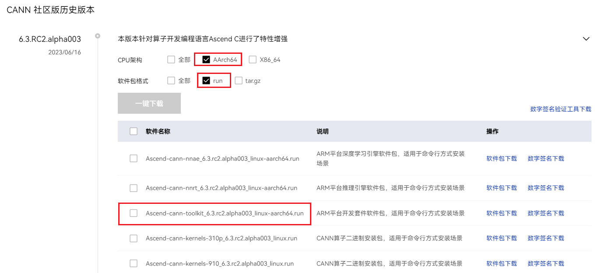
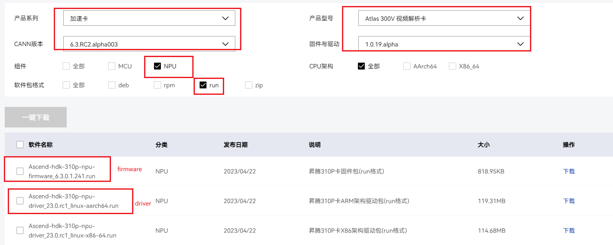

# 快速搭建与运行

## 1. 准备环境

### 硬件依赖：

需使用Ascend310P环境
 

### 软件依赖：

#### a、昇腾AI处理器配套软件包

当前版本的悟空画画共需要安装3个软件分包，分别为cann-toolkit分包、driver和firmware分包，其中cann-toolkit分包需要6.3及以上版本，driver和firmware的版本可跟随cann-toolkit而定。下列为Ascend 310P上的一种可行的分包组合：

```shell
Ascend-hdk-310p-npu-driver_23.0.rc1_linux-aarch64.run
Ascend-hdk-310p-npu-firmware_6.3.0.1.241.run
Ascend-cann-toolkit_6.3.RC2.alpha003_linux-aarch64.run
```

以aarch64架构为例（x86_64架构参考示例获取，仅后缀名有所区别），上述3个分包的详细获取过程如下：

1. 下载cann-toolkit。进入[昇腾社区CANN产品](https://www.hiascend.com/software/cann/community-history)页面，选择6.3.RC2.alpha003版本，勾选架构和文件格式过滤选项， 下载`Ascend-cann-toolkit_6.3.RC2.alpha003_linux-aarch64.run`。
   

2. 下载firmware和driver。进入[昇腾社区固件与驱动](https://www.hiascend.com/zh/hardware/firmware-drivers/community?product=2&model=18&cann=6.3.RC2.alpha003&driver=1.0.19.alpha)页面，选择按图示勾选CANN版本和产品序列等，勾选组件、文件格式等过滤条件，下载firmware和driver包。注意cann版本需与步骤1中保持一致。
   

 
安装：需严格按照[MindSpore安装指南](https://www.mindspore.cn/install)安装上述分包，**不要漏掉安装昇腾AI处理器配套软件所包含的whl包**。3个软件分包的安装顺序为driver->firmware->ascend-toolkit，安装前需卸载旧版本。

#### b、python
python==3.7

#### c、mindspore-lite

mindspore-lite>=2.1.0
悟空画画中的diffusion模型依赖mindspore-lite, 可点此直接获取MindSpore-Lite2.1.0安装包([x86_64](https://ms-release.obs.cn-north-4.myhuaweicloud.com/2.1.0/MindSpore/lite/release/linux/x86_64/cloud_fusion/python37/mindspore_lite-2.1.0-cp37-cp37m-linux_x86_64.whl), [aarch64](https://ms-release.obs.cn-north-4.myhuaweicloud.com/2.1.0/MindSpore/lite/release/linux/aarch64/cloud_fusion/python37/mindspore_lite-2.1.0-cp37-cp37m-linux_aarch64.whl))，或访问
[mindspore官网](https://mindspore.cn/lite/docs/zh-CN/r2.1/use/downloads.html) 手动选择安装


 

## 2. 准备代码

将代码克隆至本地服务器，在命令行中运行如下命令

```shell
git clone https://github.com/mindspore-lab/models.git
cd research/wukong
```

再安装python包依赖

```
pip install -r requirements.txt
```

## 3. 准备权重

悟空画画中包含5个不同尺寸（384\*640，640\*384， 512\*640， 640\*512， 512\*512）的diffusion模型权重和一个长宽同时放大4倍的超分模型，其中diffusion模型权重是```.mindir```格式（当前打包成```zip```），超分模型是```.om```格式， ```.mindir```后缀的文件为针对昇腾优化后的模型，使用MindSpore Lite Runtime推理，`.om`后缀的文件则使用ACL Runtime进行推理。模型列表如下

```shell
384_640.zip  #  diffusion模型
640_384.zip  #  diffusion模型
512_640.zip  #  diffusion模型
640_512.zip  #  diffusion模型
512_512.zip  #  diffusion模型
rrdb_srx4_fp32_new.om  #  超分模型
```

其中，每个尺寸diffusion模型需手工解压后使用，以384\*640尺寸为例内容如下， 分别包含模型结构（mindir）和对应权重(data0)

```shell
384_640.zip
├── wukong_youhua_384_640_out_graph.mindir  # 针对Ascend310P平台优化后的模型结构文件
├── wukong_youhua_384_640_out_variables  # 模型权重数据
       └── data_0
```

diffusion模型和超分模型的权重可通过如下方式获取


|         name         |                                          link                                          |
| :-------------------: | :-------------------------------------------------------------------------------------: |
|      384_640.zip      |     [zip](https://download.mindspore.cn/toolkits/mindone/wukonghuahua/384_640.zip)     |
|      640_384.zip      |     [zip](https://download.mindspore.cn/toolkits/mindone/wukonghuahua/640_384.zip)     |
|      512_640.zip      |     [zip](https://download.mindspore.cn/toolkits/mindone/wukonghuahua/512_640.zip)     |
|      640_512.zip      |     [zip](https://download.mindspore.cn/toolkits/mindone/wukonghuahua/640_512.zip)     |
|      512_512.zip      |     [zip](https://download.mindspore.cn/toolkits/mindone/wukonghuahua/512_512.zip)     |
| rrdb_srx4_fp32_new.om | [om](https://download.mindspore.cn/toolkits/mindone/wukonghuahua/rrdb_srx4_fp32_new.om) |

*注意：该表中mindir和om为针对硬件平台优化后的模型，仅适配310P平台*
 

此外，我们还提供原始的未针对硬件平台优化的mindir模型文件，您可在下载该文件后，再在相应硬件平台上转化为对应的硬件优化模型。原始模型的获取方式如下，


|        name        |                                         link                                         |
| :----------------: | :-----------------------------------------------------------------------------------: |
| origin_384_640.zip | [zip](https://download.mindspore.cn/toolkits/mindone/wukonghuahua/origin_384_640.zip) |
| origin_640_384.zip | [zip](https://download.mindspore.cn/toolkits/mindone/wukonghuahua/origin_640_384.zip) |
| origin_512_640.zip | [zip](https://download.mindspore.cn/toolkits/mindone/wukonghuahua/origin_512_640.zip) |
| origin_640_512.zip | [zip](https://download.mindspore.cn/toolkits/mindone/wukonghuahua/origin_640_512.zip) |
| origin_512_512.zip | [zip](https://download.mindspore.cn/toolkits/mindone/wukonghuahua/origin_512_512.zip) |

要进行模型转换，首先需在`{project_root}/convert/convert_ms.py`脚本中配置相关参数,主要参数为配置文件路径`config_file`,输入模型`.mindir`路径`input_file`,输出模型文件名`output_file`，输出文件会自动添加后缀`_graph.mindir`和`variables`

```python
sizes = ['384_640', '512_512', '512_640', '640_384', '640_512']

config_file = './convert/config.cni'
converter = mslite.Converter()
converter.optimize = "ascend_oriented"

for size in sizes:
    input_file = f'./models/wukong_youhua_{size}_graph.mindir'  # raw mindir file path
    output_file= f'./models/wukong_youhua_{size}_out'  # output file path, suffix '_graph.mindir' will be automaticly add
    os.makedirs(os.path.dirname(input_file), exist_ok=True)
    os.makedirs(os.path.dirname(output_file), exist_ok=True)
    converter.convert(fmk_type=mslite.FmkType.MINDIR, model_file=input_file,
                      output_file=output_file, config_file=config_file)
```

命令行中运行如下指令，即可得到转换后的模型

~~~shell
cd {project_root}/convert/convert_ms.py

python convert_ms.py
~~~

## 4. 运行

首先运行如下命令设置昇腾环境变量

```shell
source /usr/local/Ascend/ascend-toolkit/set_env.sh
```

再运行如下命令，即可根据文字提示生成预定尺寸的图片，

```shell
python txt2img_mindir_lite.py --prompt {字符串以空格分开} --mindir_path {diffusion模型地址} --sr_model_path {超分模型地址} --vocab_path {分词表} --output_mode {输出尺寸}
```

例如，如下命令可根据文字提示"油画 赛博朋克 夜景 城市 汽车 风景"生成尺寸为1280*720的图片

```shell
python txt2img_mindir_lite.py --prompt "油画 赛博朋克 夜景 城市 汽车 风景" --mindir_path ./models --sr_model_path ./models/rrdb_srx4_fp32_new.om --vocab_path ./config/vocab_zh.txt --output_mode 1
```


## 5. 代码简介

程序主入口`txt2img_mindir_lite.py`主要包含以下6部分(括号后为主要涉及的函数或类)：

1. 加载diffusion模型（`load_model`）
2. 对promt进行tokenize预处理(`WordPieceTokenizer`)
3. 使用diffusion模型进行采样(`model.predict`)
4. 对采样结果进行超分(`test_rrdb_om_srx4`)
5. 对超分结果进行resize和crop (`image_adjust`)

## 6. 常见报错

#### 1. 加载mindir模型失败，报错：RuntimeError： build_from_file failed! Error is Common error code.

该错误一般为mindir模型和当前硬件环境不匹配，建议确认当前模型的适配平台，更换硬件平台或在当前平台重新进行模型转换
 

#### 2. 加载mindir模型失败，报错：RuntimeError： Convert model failed! error is NULL pointer returned

该错误一般为ascend环境配置问题，打印debug日志只sympy包缺失

#### 3. 报错找不到acl模型

确认安装的为atlas分包，并执行了 source /usr/local/Ascend/ascend-toolkit/set_env.sh 设置了昇腾环境变量，参考资料【1】

#### 4. 执行OM模型失败，报错：Exception：acl.mdl。excute failed ret_int=507011

该错误原因为om模型与当前平台不匹配，建议更换平台至Ascend310P

#### 5. 如非常见错误，参考该资料【2】报错定位小节，打印debug级日志进行定位

 

## 7. 参考资料

#### 资料[1](https://www.hiascend.com/document/detail/zh/CANNCommunityEdition/70RC1alpha001/infacldevg/aclpythondevg/aclpythondevg_0008.html): pyacl依赖设置

#### 资料[2](https://gitee.com/youshu1/lite_hacks/blob/master/ascend_infer.md): MindSpore Lite 昇腾推理
